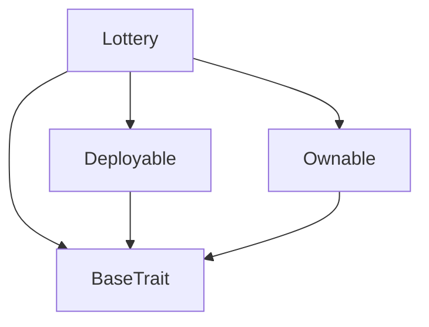
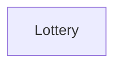

# TACT Compilation Report
Contract: Lottery
BOC Size: 5036 bytes

# Types
Total Types: 34

## StateInit
TLB: `_ code:^cell data:^cell = StateInit`
Signature: `StateInit{code:^cell,data:^cell}`

## Context
TLB: `_ bounced:bool sender:address value:int257 raw:^slice = Context`
Signature: `Context{bounced:bool,sender:address,value:int257,raw:^slice}`

## SendParameters
TLB: `_ bounce:bool to:address value:int257 mode:int257 body:Maybe ^cell code:Maybe ^cell data:Maybe ^cell = SendParameters`
Signature: `SendParameters{bounce:bool,to:address,value:int257,mode:int257,body:Maybe ^cell,code:Maybe ^cell,data:Maybe ^cell}`

## Deploy
TLB: `deploy#946a98b6 queryId:uint64 = Deploy`
Signature: `Deploy{queryId:uint64}`

## DeployOk
TLB: `deploy_ok#aff90f57 queryId:uint64 = DeployOk`
Signature: `DeployOk{queryId:uint64}`

## FactoryDeploy
TLB: `factory_deploy#6d0ff13b queryId:uint64 cashback:address = FactoryDeploy`
Signature: `FactoryDeploy{queryId:uint64,cashback:address}`

## ChangeOwner
TLB: `change_owner#819dbe99 queryId:uint64 newOwner:address = ChangeOwner`
Signature: `ChangeOwner{queryId:uint64,newOwner:address}`

## ChangeOwnerOk
TLB: `change_owner_ok#327b2b4a queryId:uint64 newOwner:address = ChangeOwnerOk`
Signature: `ChangeOwnerOk{queryId:uint64,newOwner:address}`

## Lottery$Data
TLB: `null`
Signature: `null`

## Pool
TLB: `_ poolId:uint32 creator:address rounds:dict<int, ^RoundConfig{roundId:uint32,poolId:uint32,ticketPrice:coins,startTime:uint32,endTime:uint32,active:bool}> startTime:uint32 endTime:uint32 sequence:uint32 active:bool prizes:dict<uint8, uint8> = Pool`
Signature: `Pool{poolId:uint32,creator:address,rounds:dict<int, ^RoundConfig{roundId:uint32,poolId:uint32,ticketPrice:coins,startTime:uint32,endTime:uint32,active:bool}>,startTime:uint32,endTime:uint32,sequence:uint32,active:bool,prizes:dict<uint8, uint8>}`

## RoundConfig
TLB: `_ roundId:uint32 poolId:uint32 ticketPrice:coins startTime:uint32 endTime:uint32 active:bool = RoundConfig`
Signature: `RoundConfig{roundId:uint32,poolId:uint32,ticketPrice:coins,startTime:uint32,endTime:uint32,active:bool}`

## TicketPayoutResponse
TLB: `_ ticket:^string = TicketPayoutResponse`
Signature: `TicketPayoutResponse{ticket:^string}`

## RandomTicketResponse
TLB: `_ ASCIINumber:int257 ticket:^string = RandomTicketResponse`
Signature: `RandomTicketResponse{ASCIINumber:int257,ticket:^string}`

## Ticket
TLB: `_ ticket:^string ticketNumber:int257 owner:address = Ticket`
Signature: `Ticket{ticket:^string,ticketNumber:int257,owner:address}`

## UserTicket
TLB: `_ users:dict<address, ^TicketPayoutResponse{ticket:^string}> = UserTicket`
Signature: `UserTicket{users:dict<address, ^TicketPayoutResponse{ticket:^string}>}`

## RoundTicket
TLB: `_ rounds:dict<int, ^UserTicket{users:dict<address, ^TicketPayoutResponse{ticket:^string}>}> = RoundTicket`
Signature: `RoundTicket{rounds:dict<int, ^UserTicket{users:dict<address, ^TicketPayoutResponse{ticket:^string}>}>}`

## Winner
TLB: `_ ticket:^string owner:address prize:coins = Winner`
Signature: `Winner{ticket:^string,owner:address,prize:coins}`

## ClaimInfo
TLB: `_ info:dict<int, ^UserClaim{user:dict<address, bool>}> = ClaimInfo`
Signature: `ClaimInfo{info:dict<int, ^UserClaim{user:dict<address, bool>}>}`

## UserClaim
TLB: `_ user:dict<address, bool> = UserClaim`
Signature: `UserClaim{user:dict<address, bool>}`

## Result
TLB: `_ rounds:dict<int, int> = Result`
Signature: `Result{rounds:dict<int, int>}`

## CreatePool
TLB: `create_pool#7ce849f6 jettonWallet:address ticketPrice:uint32 initialRounds:uint8 startTime:uint32 endTime:uint32 sequence:uint32 active:bool prizes:dict<uint8, uint8> = CreatePool`
Signature: `CreatePool{jettonWallet:address,ticketPrice:uint32,initialRounds:uint8,startTime:uint32,endTime:uint32,sequence:uint32,active:bool,prizes:dict<uint8, uint8>}`

## Claim
TLB: `claim#566965b8 poolId:int257 roundId:int257 amount:coins receiver:address signature:^slice = Claim`
Signature: `Claim{poolId:int257,roundId:int257,amount:coins,receiver:address,signature:^slice}`

## WinningNumbersDrawnEvent
TLB: `winning_numbers_drawn_event#d3bd2d7f poolId:int257 roundId:int257 winningNumber:int257 = WinningNumbersDrawnEvent`
Signature: `WinningNumbersDrawnEvent{poolId:int257,roundId:int257,winningNumber:int257}`

## UpdatePizes
TLB: `update_pizes#f66505b1 poolId:int257 prizes:dict<uint8, uint8> = UpdatePizes`
Signature: `UpdatePizes{poolId:int257,prizes:dict<uint8, uint8>}`

## BuyTicket
TLB: `buy_ticket#df690a99 poolId:int257 roundId:int257 quantity:int257 = BuyTicket`
Signature: `BuyTicket{poolId:int257,roundId:int257,quantity:int257}`

## DrawWinningNumbers
TLB: `draw_winning_numbers#d611ad04 poolId:int257 roundId:int257 latestTxHash:^string = DrawWinningNumbers`
Signature: `DrawWinningNumbers{poolId:int257,roundId:int257,latestTxHash:^string}`

## SetAdmin
TLB: `set_admin#ca86a987 admin:address = SetAdmin`
Signature: `SetAdmin{admin:address}`

## SetPublicKey
TLB: `set_public_key#c37bfdfe publicKey:int257 = SetPublicKey`
Signature: `SetPublicKey{publicKey:int257}`

## SetClaimFeePercent
TLB: `set_claim_fee_percent#0de724be claimFeePercent:uint8 = SetClaimFeePercent`
Signature: `SetClaimFeePercent{claimFeePercent:uint8}`

## TransferFund
TLB: `transfer_fund#dbc8382f to:address amount:coins = TransferFund`
Signature: `TransferFund{to:address,amount:coins}`

## PoolCreatedEvent
TLB: `pool_created_event#233540bc poolId:int257 ticketPrice:uint32 initialRounds:uint8 startTime:uint32 endTime:uint32 active:bool sequence:uint32 rounds:dict<int, ^RoundConfig{roundId:uint32,poolId:uint32,ticketPrice:coins,startTime:uint32,endTime:uint32,active:bool}> creator:address prizes:dict<uint8, uint8> = PoolCreatedEvent`
Signature: `PoolCreatedEvent{poolId:int257,ticketPrice:uint32,initialRounds:uint8,startTime:uint32,endTime:uint32,active:bool,sequence:uint32,rounds:dict<int, ^RoundConfig{roundId:uint32,poolId:uint32,ticketPrice:coins,startTime:uint32,endTime:uint32,active:bool}>,creator:address,prizes:dict<uint8, uint8>}`

## RoundCreated
TLB: `round_created#b994e298 roundId:int257 poolId:int257 ticketPrice:uint32 startTime:uint32 endTime:uint32 = RoundCreated`
Signature: `RoundCreated{roundId:int257,poolId:int257,ticketPrice:uint32,startTime:uint32,endTime:uint32}`

## TicketBoughtEvent
TLB: `ticket_bought_event#4a768a42 poolId:int257 roundId:int257 quantity:int257 buyer:address tickets:^string = TicketBoughtEvent`
Signature: `TicketBoughtEvent{poolId:int257,roundId:int257,quantity:int257,buyer:address,tickets:^string}`

## ClaimedEvent
TLB: `claimed_event#369f3352 poolId:int257 roundId:int257 amount:coins receiver:address = ClaimedEvent`
Signature: `ClaimedEvent{poolId:int257,roundId:int257,amount:coins,receiver:address}`

# Get Methods
Total Get Methods: 15

## admins

## isAdmin
Argument: address

## currentPool

## poolById
Argument: poolId

## usersTicket
Argument: poolId
Argument: roundId

## userTicketByAddress
Argument: poolId
Argument: roundId
Argument: user

## roundById
Argument: poolId
Argument: roundId

## resultByRound
Argument: poolId
Argument: roundId

## resultByPool
Argument: poolId

## publicKey

## claimData
Argument: poolId
Argument: roundId

## isClaim
Argument: poolId
Argument: roundId
Argument: receiver

## contractBalance

## claimFeePercent

## owner

# Error Codes
2: Stack underflow
3: Stack overflow
4: Integer overflow
5: Integer out of expected range
6: Invalid opcode
7: Type check error
8: Cell overflow
9: Cell underflow
10: Dictionary error
13: Out of gas error
32: Method ID not found
34: Action is invalid or not supported
37: Not enough TON
38: Not enough extra-currencies
128: Null reference exception
129: Invalid serialization prefix
130: Invalid incoming message
131: Constraints error
132: Access denied
133: Contract stopped
134: Invalid argument
135: Code of a contract was not found
136: Invalid address
137: Masterchain support is not enabled for this contract
10050: Invalid claim fee percent
13687: Pool is not active
20265: Winning numbers already drawn
24801: Round is not open for ticket purchases
26690: Invalid prizes
36876: Round does not exist
41780: Total prize must be less than or equal to 100
42120: Pool does not exist
42342: Sequence must be positive
45000: Insufficient funds in the contract
47697: Round is not active
50778: Round is still active
52453: Initial rounds must be positive
52657: Prizes must be set
57401: Start time must be before end time
58319: Only the owner or admin can call this function
58383: Insufficient funds sent
59272: Quantity must be positive
61167: Invalid claim

# Trait Inheritance Diagram

# Contract Dependency Diagram

